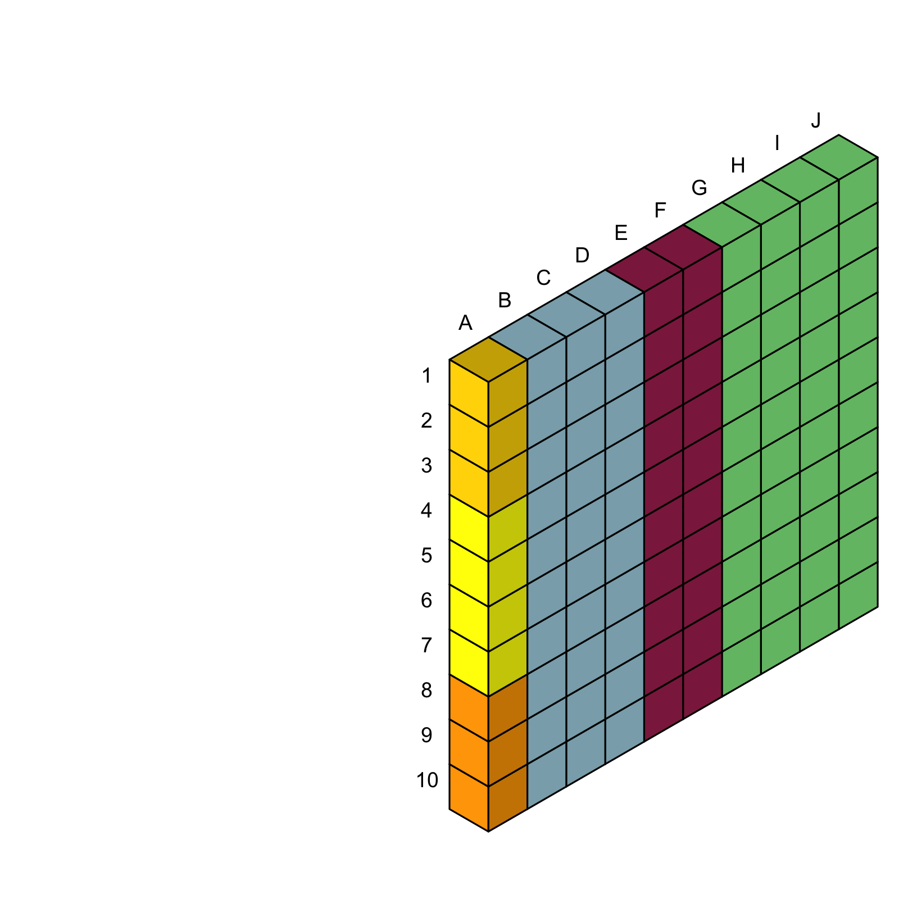
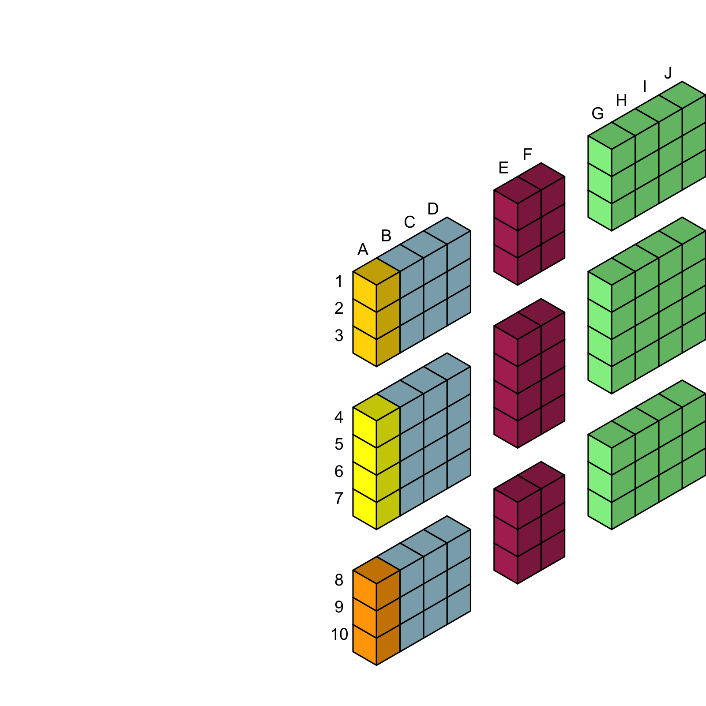

<!-- README.md is generated from README.Rmd. Please edit that file -->

# isotib

<!-- badges: start -->

[](https://github.com/kjhealy/isotib/actions/workflows/R-CMD-check.yaml)
<!-- badges: end -->

## Installation

You can install the development version of isotib from
[GitHub](https://github.com/) with:

``` r
# install.packages("devtools")
devtools::install_github("kjhealy/isotib")
```

## Example

``` r
library(isotib)


x_labs_basic <- rev(LETTERS[1:10])
y_labs_basic <- rev(c(1:10))

x_labs_cut <- rev(c("A", "B", "C", "D", "", "E", "F", "", "G", "H", "I", "J"))
y_labs_cut <- rev(c("1", "2", "3", "", "4", "5", "6", "7", "", "8", "9", "10"))

png(filename = (file <- here::here("man", "figures", "isotib1.png")), 1600, 1600, res = 300)
grid::grid.newpage()
draw_column(xpos = 2:10, fill = c(rep("lightblue", 3),
                                  rep("maroon", 2),
                                  rep("lightgreen", 4)),
            darkenby = 0.1)
draw_column(xpos = 1, fill = c(rep("orange", 3), rep("yellow", 4),
                               rep("gold", 3)), darkenby = 0.1)

make_textvec(height = 1:10, width = 1, label = y_labs_basic) |>
  draw_text(darkenby = 0.1, orient = "col",
          ysize = 1/20) |>
  grid::grid.draw()
make_textvec(width=1:10, height = 10, label = x_labs_basic) |>
  draw_text(darkenby = 0.1, orient = "row",
          ysize = 1/20) |>
  grid::grid.draw()
crop::dev.off.crop(file = file)


x_labs_cut <- rev(c("A", "B", "C", "D", "", "", "E", "F", "", "", "G", "H", "I", "J"))
y_labs_cut <- rev(c("1", "2", "3", "", "", "4", "5", "6", "7", "", "", "8", "9", "10"))


png(filename = (file <- here::here("man", "figures", "isotib2.png")), 1600, 1600, res = 300)
scalef <- 26
grid::grid.newpage()
draw_column(xpos = 2:length(x_labs_cut),
            ncubes = length(y_labs_cut),
            fill = c(rep("lightblue", 5),
                                  rep("maroon", 4),
                                  rep("lightgreen", 4)),
            darkenby = 0.1,
           delete_x = c(5,6,9,10),
           delete_y = c(4,5,10,11),
            ysize = 1/scalef)
draw_column(xpos = 1, ncubes = length(y_labs_cut), 
            fill = c(rep("orange", 5), rep("yellow", 4),
                               rep("gold", 5)), darkenby = 0.1,
            delete_x = c(5,6,9,10),
            delete_y = c(4,5,10,11),
            ysize = 1/scalef)

make_textvec(height = 1:length(y_labs_cut), width = 1, label = y_labs_cut) |>
  draw_text(darkenby = 0.1, orient = "col",
          ysize = 1/scalef) |>
  grid::grid.draw()

make_textvec(width=1:length(x_labs_cut), height = 14, label = x_labs_cut) |>
  draw_text(darkenby = 0.1, orient = "row",
          ysize = 1/scalef) |>
  grid::grid.draw()
crop::dev.off.crop(file = file)
```




